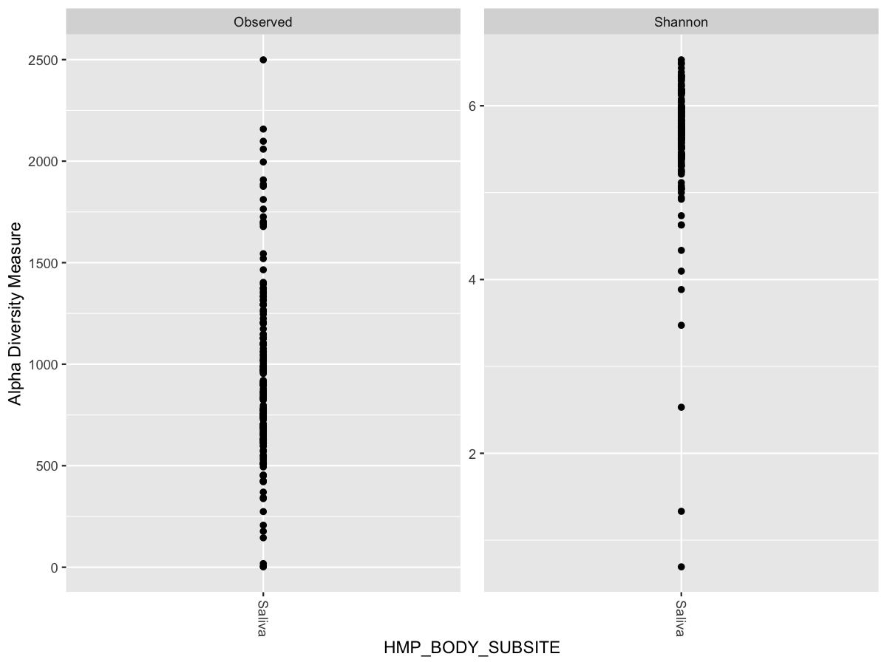
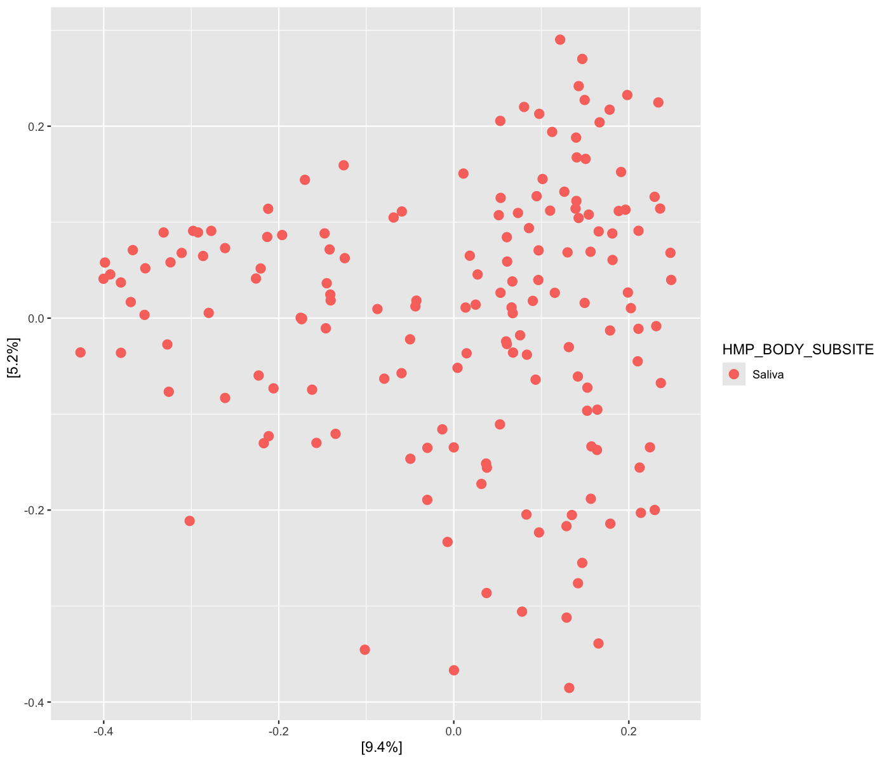
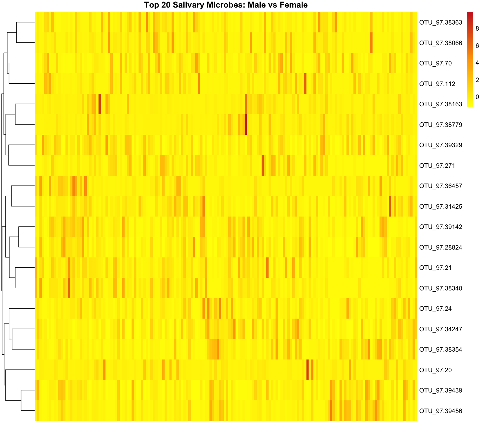
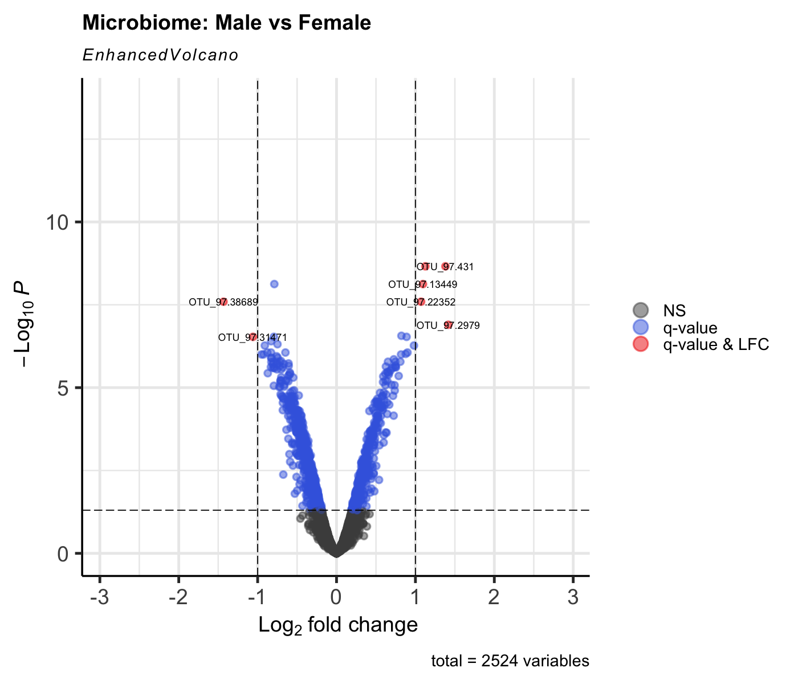
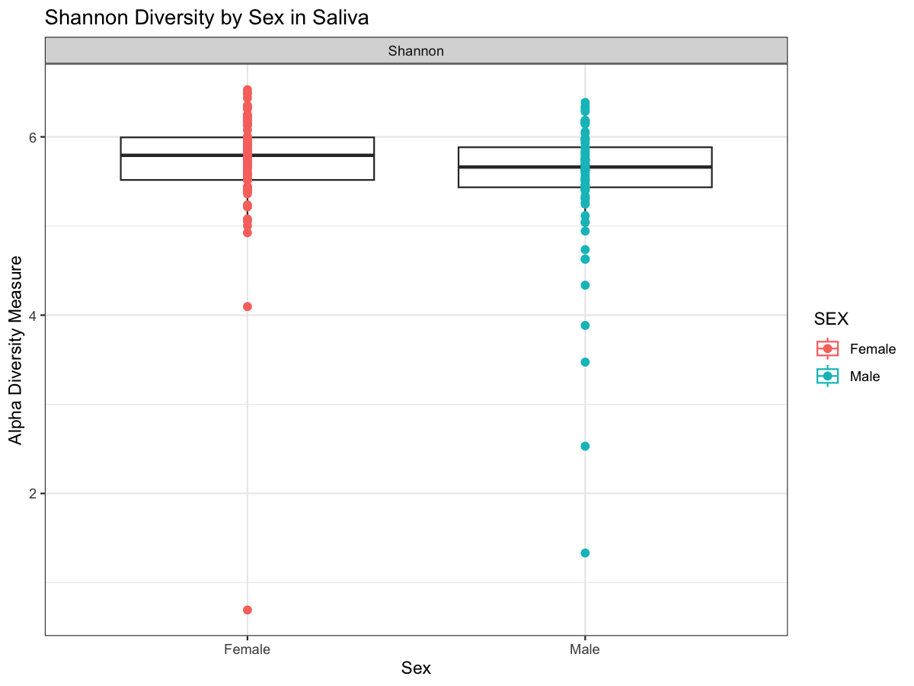
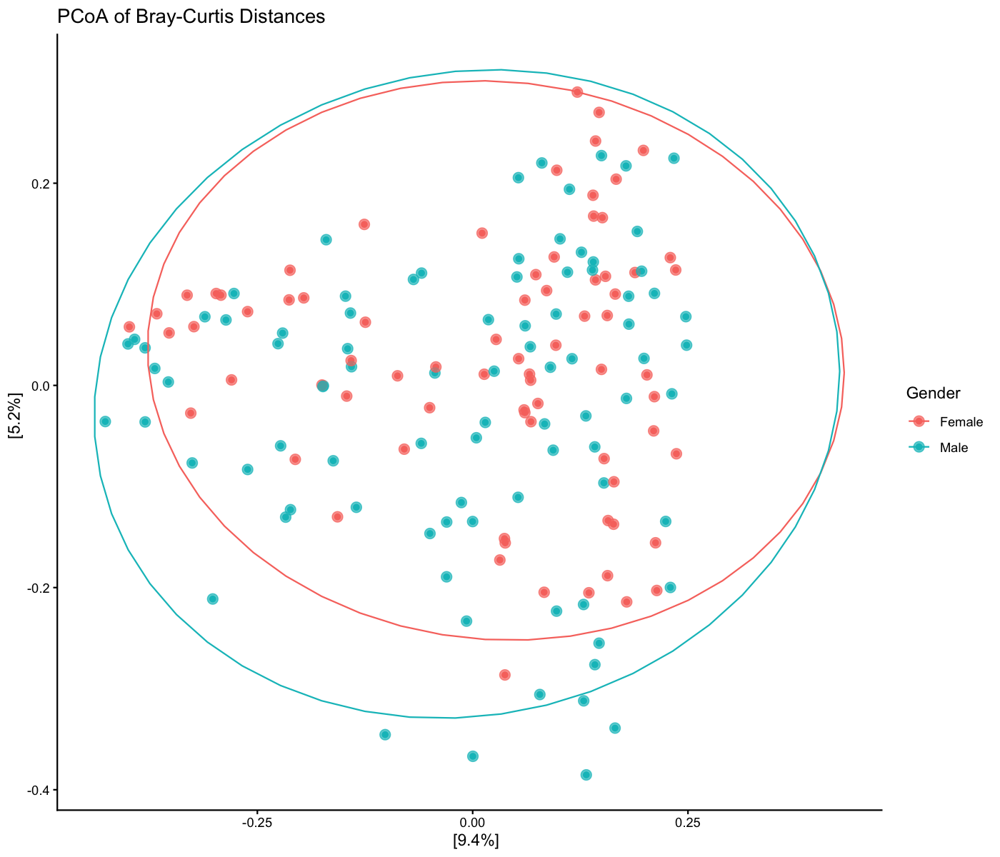

# Human Microbiome Phyloseq Project

## Introduction/Project Summary
This project analyzes salivary microbiome data from the Human Microbiome Project (HMP V1–V3) using R and Bioconductor.
I processed 162 saliva samples (14428 taxa), performed ecological diversity analysis (alpha, beta, and PCoA), and tested for significance between male and female saliva microbes using PERMANOVA.
I then performed differential abundance testing via ANCOM-BC2 and identified 1011 significantly different microbes out of a total of 2524.
Despite these individual differences, sex explained only 0.764% of total variance, therefore possessing minimal biological impact on overall community composition.
This project demonstrates real-world microbiome workflows: phyloseq analysis, diversity metrics, PCoA, PERMANOVA, differential abundance analysis (ANCOM-BC2), volcano plots, heatmaps, and biological interpretation.

## Install necessary packages

```r
BiocManager::install(c("HMP16SData", "phyloseq", "ANCOMBC", "EnhancedVolcano"))
install.packages(c("ggplot2", "dplyr", "vegan", "pheatmap"))
```

## Load necessary packages

```r
library(HMP16SData)
library(phyloseq)
library(ggplot2)
library(vegan)
library(ANCOMBC)
library(dplyr)
library(pheatmap)
library(EnhancedVolcano)
```

## Convert Microbiome Data into phyloseq

```r
#Load sequencing data for variable regions 1–3 (V1-V3) from the HMP (the database is very large, selecting a subset of variable regions makes the analysis easier and less time consuming
hmp_se_data <- V13()

#Convert microbiome data into phyloseq (phyloseq is a useful R package that helps with analyzing, interpreting, and visualizing microbiome statistical data)
ps_hmp <- as_phyloseq(hmp_se_data)
```

## Filter salivary samples and non-zero taxa values
The Human Microbiome Project database is very large, filtering for a region of interest makes interpretation much easier and less time-consuming

```r
#Filter saliva samples
ps_hmp_saliva <- subset_samples(ps_hmp, HMP_BODY_SUBSITE == "Saliva")

#Filter non-zero data
ps_hmp_saliva <- prune_taxa(taxa_sums(ps_hmp_saliva) > 0, ps_hmp_saliva)

#Idenify how many samples and taxa present in the saliva dataet
ps_hmp_saliva
```
Output

```text
phyloseq-class experiment-level object
otu_table()   OTU Table:         [ 14428 taxa and 162 samples ]
sample_data() Sample Data:       [ 162 samples by 7 sample variables ]
tax_table()   Taxonomy Table:    [ 14428 taxa by 6 taxonomic ranks ]
phy_tree()    Phylogenetic Tree: [ 14428 tips and 12701 internal nodes ]
```
14428 taxa and 162 samples (male and female) are present in the filtered subset.

## Extract tables for the saliva subset
Take data from the HMP phyloseq and turn them into tables that are easy to visualize and interpret.

```r
#this will make a table consisting of the operational taxonomic units (OTU) abundance which illustrates the raw counts of how many microbes appear in a certain sample
counts_table <- otu_table(ps_hmp_saliva)
#metadata table consists of each sample and the sex and body site/subsite it was taken from (for example: male and oral/saliva) as well as the sequencing center (a potential batch effect).  Include the data.frame code to convert vectors into tables
metadata_table <- as(sample_data(ps_hmp_saliva), "data.frame")
#the taxonomy table consists of a long list of each microbe found in the human saliva sample organized into taxonomic levels from superkingdom to species.
taxonomy_table <- tax_table(ps_hmp_saliva)
#a phylogeny tree illustrates which organisms are related and fall under the same evolutionary group (example: same genus or order).
phylogeny_tree <- phy_tree(ps_hmp_saliva)
```

## Determining the alpha and beta diversity of the sample population

The purpose of determining the alpha and beta parameters is to analyze the microbial diversity within tbe subsetted sample (salivary). Alpha diversity measures the diversity of different microbes within a single sample, where a high alpha diversity indicates high abundance of a certain microbe in a sample (example: saliva), whereas a low diversity a lower abundance. On the other hand, beta diversity measures the similarity of microbial species between different samples (example: multiple saliva sample). A high beta diversity indicates that there is a difference in composition between samples (example: sample 1 may have more Campylobacter in their saliva while another may have more Neisseria), whereas a low diversity indicates they are similar (both samples have a similar abundance of Prevotella).
To make this easier to understand, alpha diversity is like to counting the different colors of jelly beans in one jar, while beta diversity is similar to comparing two jars and determining if they have the same jelly bean colors.

### Alpha Diversity
Here I will use Shannon the index to calculate the alpha diversity. The Shannon index is a useful here since it helps with estimating species richness (number of different species are present in the saliva sample) and evenness (how evenly distributed microbes are).

```r
#Calculate alpha diversity
#In this context, richness means how many different species exist in the saliva samples, which helps with determining if there is high or low alpha diversity.
alpha <- estimate_richness(ps_hmp_saliva, measures = c("Shannon", "Observed"))
#The head function will print the top 6 results
head(alpha)
```
Output

```text
           Observed  Shannon
X700014403     1349 5.622925
X700014501     1726 6.386653
X700014559     1886 6.186757
X700014611     1520 5.738327
X700014783     1096 5.740584
X700014909      610 5.711375
```

```r
#Plot results (this will illustrate a vertical plot of multiple scatter points showing species abundance and diversity)
plot_richness(ps_hmp_saliva, x="HMP_BODY_SUBSITE", measures=c("Shannon","Observed"))
```



Interpretation: This plot represents the “Observed”, which measures species abundance, and “Shannon”, which measures species abundance and evenness (how evenly abundant the species are). The “Observed” plot has a wide distribution, indicating that there is wide range of species in the sample (high richness). The “Shannon” plot has concentrated measure between 5-6.5, which indicates higher species richness and evenness. Both plots indicate that the saliva samples has high richness and evenness.

### Beta Diversity and PERMANOVA
To calculate the beta diversity of the saliva microbiome data, I used Bray-Curtis and Permutational Multivariate Analysis of Variance (PERMANOVA). Bray-Curtis is a standard tool used to measure species composition between two sites and is sensitive to differences between groups. PERMANOVA helps with comparing community composition between groups by using permutations (different ways to organize and rearrange a group of items) a to get p-values.

```r
#Calculate beta diversity
#Calculate the Bray-Curtis distance matrix to measure how different each samples are from one another
dist.bc <- phyloseq::distance(ps_hmp_saliva, method = "bray")
#Ordination (use PCoA here, this takes complex matrix and turn it into an easy-to-read 2D or 3D scatter plot)
ord <- ordinate(ps_hmp_saliva, method = "PCoA", distance = "bray")
#Plot (this will create the scatter plot consisting of the data obtained from the ordinate step)
plot_ordination(ps_hmp_saliva, ord, color = "HMP_BODY_SUBSITE") +
     geom_point(size = 3)
```


Interpretation: The PCoA plot illustrates that the points are spread out, indicating high species diversity amongst various salivary samples, and therefore, a high beta diversity.

Next, perform PERMANOVA to test for statistical significance between microbe diversity and sex

```r
#Here a seed is set to ensure reproducibility. Think of PERMANOVA as shuffling cards. Each seed value will determine a different shuffling sequence. A seed of 123 is very commonly used in statistical analysis.
set.seed(123)
#permanova is done via adonis2. I selected permutations = 9999, meaning the data is shuffled 9999 times to calculate the p-value. This value is selected because it ensures a precise p-value.
permanova_result_sex <- adonis2(dist.bc ~ SEX, data = metadata_table, permutations = 9999)
print(permanova_result_sex)
```
Output

```text
Permutation test for adonis under reduced model
Permutation: free
Number of permutations: 9999

adonis2(formula = dist.bc ~ SEX, data = metadata_table, permutations = 9999)
          Df SumOfSqs      R2      F Pr(>F)  
Model      1    0.444 0.00764 1.2319 0.0974 .
Residual 160   57.665 0.99236                
Total    161   58.109 1.00000                
---
Signif. codes:  0 '***' 0.001 '**' 0.01 '*' 0.05 '.' 0.1 ' ' 1
```

Interpretation: Pr(>F) represents the p-value. Here p > 0.05 and is borderline. I therefore fail to reject the null hypothesis which states there is no statistical evidence between microbial species diversity and sex. According to the R2 value, sex only accounts for 0.764% of the variance.

## Measuring the differential abundance analysis of salivary microbes
Here I will measure the differential abundance analysis to determine statistical differences between selected groups. In this example, I will perform an analysis of salivary microbial communities between samples obtained from males versus females. There are different methods used to measure differential abundance, including DESeq2, ALDEx2, and ANCOM-BC2. DESeq2 is a widely-used tool, but is prone to false positives. Additionally, it is designed to analyze RNA-Seq data as opposed to ecological data. ALDEx2 reduces the number of false positives, but takes a very long time to code and obtain results in R. Here, I will use ANCOM-BC2, the gold standard for microbiome abundance analysis as it directly addresses the compositional nature of microbiome datasets and analyze the results as it is.
PERMANOVA measured statistical significance between overall species diversity and sex, while ANCOM-BC2 measures statistical significance between individual species diversity and sex.

```r
#ANCOM-BC2 calculation (this step can take some time)
ancom_res <- ancombc2(
    data = ps_hmp_saliva,       #Inputs phyloseq data here
    assay_name = "counts",     #This tells the code to look for the number of times each microbe was found in the data object
    tax_level = NULL,          #This tells the code to look at microbes individually rather than group based on family/order/genus.
    fix_formula = "SEX",       #The variable tested is "SEX" (males vs females)
    rand_formula = NULL,  #Set this as “NULL” because I want to obtain individual saliva samples from different people instead of obtaining samples from the same person multiple times
    p_adj_method = "fdr",      #False discovery rate (FDR) helps get rid of random, significant results in the data that appear by pure luck
    group = "SEX"              #This is the grouping variable
)	
#res_df will compile everything
results_df <- ancom_res$res
#results_df is a very extensive dataset, the head function reduces this burden and prints the top 6 lines.
head(results_df)
```
Output

```text
         taxon lfc_(Intercept) lfc_SEXMale se_(Intercept) se_SEXMale W_(Intercept)
1   OTU_97.347      0.17208527 -0.53751287     0.08485310 0.11965462     2.0280375
2 OTU_97.22512     -0.01635767 -0.08617402     0.03609884 0.08029354    -0.4531357
3 OTU_97.22626      0.19988293 -0.38407410     0.08230204 0.12119020     2.4286511
4  OTU_97.1115      0.25297327 -0.71902873     0.03241935 0.07663387     7.8031576
5 OTU_97.39060      0.08377950 -0.06936566     0.04553661 0.09340451     1.8398273
6 OTU_97.15739      0.01953301 -0.09215739     0.04967190 0.09285716     0.3932407
   W_SEXMale p_(Intercept)    p_SEXMale q_(Intercept)    q_SEXMale diff_(Intercept)
1 -4.4922033  4.942647e-02 6.124178e-05  9.388261e-02 4.845588e-04            FALSE
2 -1.0732372  6.561813e-01 2.981637e-01  7.592799e-01 4.320121e-01            FALSE
3 -3.1691844  1.772685e-02 2.267400e-03  3.850479e-02 8.478398e-03             TRUE
4 -9.3826490  3.488070e-07 2.359239e-08  3.322222e-06 1.677697e-06             TRUE
5 -0.7426372  7.322284e-02 4.620406e-01  1.311671e-01 5.910747e-01            FALSE
6 -0.9924640  6.962299e-01 3.269373e-01  7.883733e-01 4.602285e-01            FALSE
  diff_SEXMale passed_ss_(Intercept) passed_ss_SEXMale
1         TRUE                  TRUE              TRUE
2        FALSE                 FALSE              TRUE
3         TRUE                 FALSE             FALSE
4         TRUE                 FALSE             FALSE
5        FALSE                  TRUE              TRUE
6        FALSE                  TRUE              TRUE
```

Interpretation: The q_SEXMale column represents the FDR-adjusted p-values and diff_SEXMale column represents whether to there is statistical significance between saliva microbe abundance and sex. For species 1, 3, and 4, p < 0.05 and diff_SEXMale is “TRUE”, therefore I reject the null hypothesis which states there is no statistical significance between species abundance and sex. Since the lfc_SEXMale values are negative for species 1, 3, and 4, I conclude they are more abundant in females. Conversely, in species 2, 5, 6, p > 0.05 and diff_SEXMale is “FALSE”,  and I fail to reject the null hypothesis.

Next, determine total count of taxa analyzed via ANCOM-BC2 and the number of statistically significant microbes (p < 0.05).

```r
#Count how many total taxa present after applying ANCOM-BC2 analysis
nrow(results_df)
```
Output

```text
[1] 2524
```

```r
#Count how many taxa have an adjusted p-value (q-value) < 0.05
sum(results_df$q_SEXMale < 0.05, na.rm = TRUE)
```
Output

```text
[1] 1011
```

Interpretation: Out of 2524 abundant microbes tested, 1011 showed significant differences in abundance between sexes

## Creating a heat map/dendrogram to illustrate if there is a difference in abundance in the top 20 microbes between male and female saliva samples
I want to see the top 20 most abundant microbes in the various male and female saliva samples and assess the diversity in overall diversity profile. This can be visualized via a heatmap

```r
# Convert OTU table to matrix
otu_mat <- as(otu_table(ps_hmp_saliva), "matrix")
# Ensure taxa are rows
if (!taxa_are_rows(ps_hmp_saliva)) {
  otu_mat <- t(otu_mat)
}
#Filter top 20 most abundant taxa across all samples
top20_taxa <- names(sort(rowSums(otu_mat), decreasing = TRUE))[1:20]
# Subset matrix to top 20
mat <- otu_mat[top20_taxa, , drop = FALSE]
# Normalize per sample (relative abundance %), avoid division by zero
col_sums <- colSums(mat)
col_sums[col_sums == 0] <- 1
mat <- t(t(mat) / col_sums * 100)
#Perform Z-score
mat_scaled <- t(scale(t(mat))) 
# Remove rows with zero variance (required by pheatmap)
mat_scaled[is.na(mat_scaled)] <- 0
#Plot heatmap
pheatmap(mat_scaled, main = "Top 20 Salivary Microbes: Male vs Female", cluster_rows = TRUE, cluster_cols = FALSE, show_colnames = FALSE, color = colorRampPalette(c("yellow", "orange", "firebrick3"))(100))
```



Interpretation: The data across multiple samples and microbes is very consistent with few distinct red plots indicating higher abundance. This plot overall confirms the PERMANOVA analysis and illustrates that there is no statistical significance between sex and microbiome abundance. The dendrograms illustrate microbe hierarchical clustering and the row abundances appear consistent with the dendrogram branching.

## Creating a Volcano Plot
A volcano plot can be used to visually the ANCOMBC differential abundance analysis results. As previously seen, 1011 out of a total of 2524 microbes were measured to be significant. This plot will represent the log fold change on the x axis and p value on the y axis. The x axis will represent microbes statistically significant in male vs female samples while the y axis  will measure how statistically significant each microbe is.

```r
EnhancedVolcano(results_df,
    lab = results_df$taxon,        # Column with OTU or Taxon names
    x = "lfc_SEXMale",             # ANCOM-BC2's Log Fold Change
    y = "q_SEXMale",               # ANCOM-BC2's Adjusted P-value
    title = "Microbiome: Male vs Female",
    pCutoff = 0.05,
    FCcutoff = 1.0,
)
```


Interpretation: Here, female sample microbes are represented with a negative log fold change, while male sample microbes are represented with a positive log fold change. The volcano plot does confirm the ANCOMBC outputs and illustrates significant microbes that are unique to either male and female samples. However, the maximum statistical significance observed in the plot is around ~10^8, and there only a handful of microbes that are highly significant - OTU_97.38689 and OTU_97.31471 in women and OTU_97.431, OTU_97.13449, OTU_97.22352, and OTU_97.2979 in men. Overall this plot confirms the findings of the differential abundance performed above which measured significant microbes across male and female samples.

## Creating an Alpha Diversity Box Plot to compare Diversity of Microbes between Male and Female Saliva Samples (Shannon method)
Generate a Shannon index alpha diversity plot to compare microbe diversity between male and female samples.

```r
plot_richness(ps_hmp_saliva, 
              x = "SEX", 
              measures = c("Shannon")) +
  geom_boxplot(alpha = 0.6) + #adds the boxplot
  geom_point(size = 2, aes(color = SEX)) + #adds the plots and gives male and female group a different color.
  labs(title = "Shannon Diversity by Sex in Saliva", x = "Sex") +
  theme_bw() #generates a professional and easy-to-read graph
```



Interpretation: As previously stated, Shannon measures species abundance and evenness. Here, there is a high alpha diversity amongst male and female saliva microbes, where the minor differences are females samples possessing more consistent diversity measures and less outliers than males. This plot therefore illustrates that female saliva samples have a more clustered diversity profile and male samples have a wider diversity profile.

## Creating a Beta Diversity PCoA Scatter Plot to compare Diversity of Microbes between Male and Female Saliva Samples (Bray-Curtis method)
Here I want to compare the beta diversity of microbes between male and female samples via a PCoA scatter plot

```r
#ordinate via Bray-Curtis then plot
ord <- ordinate(ps_hmp_saliva, method = "PCoA", distance = "bray")
plot_ordination(ps_hmp_saliva, ord, color="SEX") + #same plot as above but add SEX as a variable for analyzing diversity differences
     geom_point(size=3, alpha=0.7) + #this step adds the points
     labs(title="PCoA of Bray-Curtis Distances", color="Sex") + #color points by sex
     stat_ellipse(aes(color = SEX)) + # Nice to have, adds confidence ellipses to make sure the points are within it
     theme_classic()
```



Interpretation: The scatter plots of each male and female saliva sample are moderately spread, indicating variation in microbial community composition between individual samples. However a lot of the male and female saliva sample points overlap, therefore proving there is a similar diversity and abundance pattern amongst both groups. This confirms the earlier findings in the PERMANOVA and ANCOM-BC2 analysis.

## Conclusion
I utilized different methods to analyze the microbiome profile of male and female saliva samples, including alpha and beta diversity/PERMANOVA, ANCOM-BC2 differential abundance analysis, and visualization. Out of 2524 abundant microbes tested, 1011 showed significant differences in abundance between sexes. However, because PERMANOVA showed that sex influences a very little percentage (0.764%) of the overall microbial variance, these individual differences are likely minor and do not change the overall pattern of the salivary microbiome between men and women.
To consider other sources of variation (batch effects), the following code sequence can be performed:

```r
#find batch effect variable in metadata table (ex “RUN_CENTER” for sequencing center)
colnames(metadata_table)
#perform ANCOM-BC2 taking “RUN_CENTER” batch effect into account
# ANCOM-BC2 calculation adjusted for batch effect
ancom_res <- ancombc2(
    data = ps_hmp_saliva,       
    assay_name = "counts",     
    tax_level = NULL,          
    # UPDATED: Include RUN_CENTER to account for batch variation
    fix_formula = "SEX + RUN_CENTER", 
    rand_formula = NULL,  
    p_adj_method = "fdr",      
    group = "SEX"              
)	
results_df <- ancom_res$res
head(results_df)
```

## Final Note
Analysis was performed using the Bioconductor ecosystem (phyloseq, vegan, ANCOM-BC2). AI tools were utilized to optimize code syntax and visualization parameters, while ecological interpretations and statistical validations were manually conducted to ensure biological accuracy.

